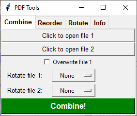

Merge, reorder, rotate, extract pages and display document information about PDF files.

# What is it?
PDFtools is a pure python implementation of a set of utilities for manipulating PDF files. It includes a lightweight GUI wrapper.

In this repository you'll find:
* Python implementations of all utilities
* Tkinter gui wrapper for these utilities
* .bat file for desktop shortcut

# Requires
* python version 3.6 or newer
* PyPDF2 version 1.26.0 or newer
* tkinter version 8.6 or newer

# Usage
* python pdftools.py

# Utilities
* pdfcombine.py - Merge PDF files
* pdfreorder.py - Reorder pages of a PDF file
* pdfrotate.py  - Rotate pages of a PDF file
* pdfinfo.py    - Display document info
* pdftools.py   - Simple GUI wrapping the utilities

# Compatibility
PDFtools has been tested on Windows 10 and Ubuntu 20.04.

> Written with [StackEdit](https://stackedit.io/).
